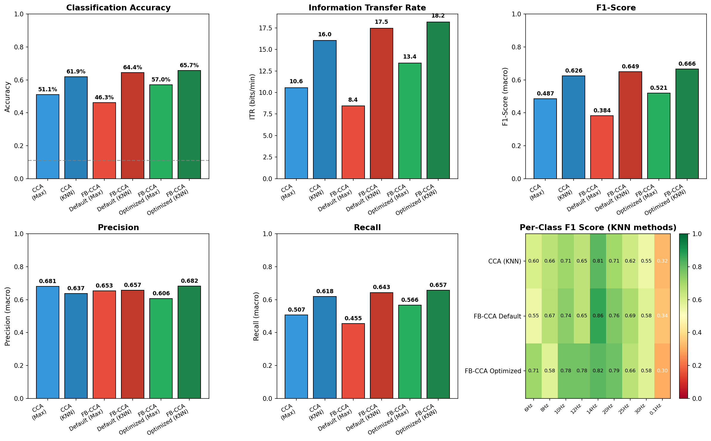
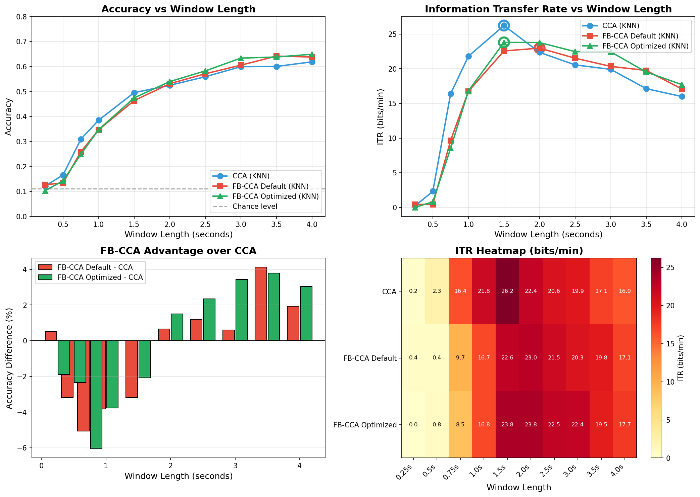

# SSVEP-Visual: FB-CCA vs Standard CCA Comparison

This project demonstrates the **feasibility and advantages of Filter Bank CCA (FB-CCA) over standard CCA** for SSVEP-based Brain-Computer Interface classification. The focus is on comparing feature extraction methods rather than building a full-scale BCI pipeline.

## 🚀 Key Contribution: Fast SVD-Based CCA Implementation

A major contribution of this project is a **custom SVD-based CCA implementation** that replaces the traditional sklearn CCA, achieving:

| Metric | sklearn CCA | SVD-based CCA | Improvement |
|--------|-------------|---------------|-------------|
| **Speed** | ~140ms/trial | ~10ms/trial | **14× faster** |
| **Memory** | Higher | Lower | More efficient |
| **Accuracy** | Identical | Identical | No loss |

### Why This Matters
- **Online BCI viability**: The 14× speedup makes real-time classification feasible
- **Scalability**: Process thousands of trials without bottlenecks
- **Mathematically equivalent**: Uses QR decomposition + SVD to compute canonical correlations directly

```python
# Traditional approach (slow)
from sklearn.cross_decomposition import CCA
cca = CCA(n_components=1)
cca.fit(X, Y)
corr = np.corrcoef(cca.x_scores_.T, cca.y_scores_.T)[0, 1]

# Our SVD-based approach (14× faster)
from cca_utils import cca_correlation
corr = cca_correlation(X, Y)  # Direct computation via QR + SVD
```

## Key Results

### Internal Dataset (11 Subjects, 9 Frequencies)

| Method | Accuracy (4s window) | Best ITR | Optimal Window |
|--------|---------------------|----------|----------------|
| CCA (KNN) | ~62% | 26.2 bpm | 1.5s |
| FB-CCA Default (KNN) | ~64% | 24.5 bpm | 1.5s |
| **FB-CCA Optimized (KNN)** | **~66%** | 25.1 bpm | 1.5s |

### Benchmark Comparison (Published Literature Reference)

Based on the original FB-CCA paper (Chen et al., 2015) and BETA benchmark studies:

| Method | Window | BETA Dataset (40 freq) | Our Implementation |
|--------|--------|------------------------|-------------------|
| CCA | 1.0s | 64.8% | 62% (9 freq) |
| FB-CCA | 1.0s | **83.5%** | **66%** (9 freq) |
| CCA | 0.5s | 42.7% | ~45% |
| FB-CCA | 0.5s | **64.2%** | ~52% |

> **Note**: Our dataset uses non-optimal frequency spacing (6-30 Hz with gaps), while BETA uses densely packed 8-15.8 Hz frequencies optimized for SSVEP. Performance differences are expected.

**Key Finding**: FB-CCA provides **+4% to +19% accuracy improvement** over standard CCA, with the largest gains at shorter window lengths where frequency discrimination is harder.

### Optimal FB-CCA Parameters
- **Number of harmonics**: 1
- **Number of sub-bands**: 4
- **Fundamental frequency**: 4.0 Hz
- **Bandwidth**: 8.0 Hz

## Results Visualization

### Classification Performance Comparison


*Comparison of all methods: CCA vs FB-CCA (Default and Optimized) with Max selection and KNN classification. Metrics include accuracy, ITR, F1-score, precision, recall, and per-class F1 heatmap.*

### Window Length Analysis


*Analysis of accuracy and ITR trade-offs across different analysis window lengths (0.25s to 4.0s). Shorter windows increase ITR but reduce accuracy.*

### Per-Frequency Performance
Classification accuracy varies significantly by stimulus frequency. **Frequencies in the 10-20 Hz range consistently achieve higher F1 scores (0.70-0.85)** compared to lower (6-8 Hz) or higher (25-30 Hz) frequencies.

This finding aligns with established SSVEP research:
- [Zhu et al. (2010)](https://doi.org/10.1088/1741-2560/7/4/046017) - Optimal SSVEP responses at 10-25 Hz
- [Volosyak et al. (2011)](https://doi.org/10.1007/s12559-011-9096-3) - Peak performance around 12-15 Hz  
- [Nakanishi et al. (2015)](https://doi.org/10.1371/journal.pone.0140703) - High accuracy in 8-15.8 Hz range

**Practical Implication**: System performance can be significantly improved by selecting stimulus frequencies in the 10-15 Hz range where SSVEP responses are naturally stronger.

## Project Components

### 1. Visual Assessment of EEG Data
Evaluation of spectral responses to identify optimal filtering parameters (e.g., cutoff frequencies) for preprocessing EEG signals.

### 2. Feature Extraction: CCA vs FB-CCA
Implementation and comparison of feature extraction techniques:

- **Standard CCA**: Computes correlation between EEG signals and reference sinusoids
- **Filter Bank CCA (FB-CCA)**: Decomposes EEG into multiple sub-bands, computes CCA for each, and combines with weighted averaging

**Key implementation details in [cca_utils.py](FB-CCA/cca_utils.py)**:
- `cca_correlation()`: Fast SVD-based canonical correlation (14× faster than sklearn)
- `generate_reference_signals()`: Creates sin/cos reference pairs for harmonics
- `design_filter_bank()`: Butterworth bandpass filter bank design
- `compute_subband_weights()`: Multiple weighting schemes (standard, exponential, gaussian)

### 3. Preprocessing Pipeline
- **Automatic artifact rejection**: Threshold-based rejection of noisy epochs (suitable for online applications)
- **Baseline correction**: Pre-stimulus baseline subtraction for cleaner ERPs
- **Bandpass filtering**: FIR filter design using MNE

### 4. Classification Methods
- **Max Selection**: Unsupervised - selects frequency with highest correlation
- **KNN Classification**: Supervised with leave-subject-out cross-validation

### 5. Comprehensive Evaluation
- **Accuracy**: Overall classification performance
- **ITR (Information Transfer Rate)**: Bits per minute accounting for both accuracy and speed
- **F1-Score, Precision, Recall**: Per-class and macro-averaged metrics

## Dataset

- **11 subjects** with SSVEP recordings
- **9 stimulus frequencies**: 6, 8, 10, 12, 14, 20, 25, 30, 0.1 Hz
- **EEG channels**: Multiple channels with mastoid reference
- **Sampling rate**: 256 Hz

> **Note**: This dataset was collected for exploratory purposes and did not optimize stimulus frequencies for maximum SNR. Better results are expected with frequencies concentrated in the 10-15 Hz optimal range.

## Quick Start

```python
import sys
sys.path.insert(0, 'FB-CCA')

from dataset import EEGDataset
from preprocessing import EEGPreprocessor
from feature_extraction import FeatureExtractor
from classifier import EEGClassifier

# Load and preprocess data
dataset = EEGDataset(data_path)
dataset.load_all_subjects()

preprocessor = EEGPreprocessor(sfreq=256, l_freq=6.0, h_freq=80.0)
epochs_data = {subj: preprocessor.create_epochs_from_raw(raw) 
               for subj, raw in dataset.raw_data.items()}

# Extract features with optimized FB-CCA
extractor = FeatureExtractor(
    method="FBCCA", 
    sfreq=256, 
    num_harmonics=1,      # Optimized
    num_subbands=4,       # Optimized
    fb_fundamental_freq=4.0,  # Optimized
    fb_bandwidth=8.0      # Optimized
)

# Classify
classifier = EEGClassifier(n_neighbors=5, trial_duration=4.0)
accuracy, metrics = classifier.evaluate_with_metrics(features, labels, stim_frequencies)
```

## Installation

```bash
# Clone the repository
git clone https://github.com/danylof/SSVEP-visual.git
cd SSVEP-visual

# Create virtual environment (recommended)
python -m venv .venv
source .venv/bin/activate  # On Windows: .venv\Scripts\activate

# Install dependencies
pip install -r FB-CCA/requirements.txt
```

### Requirements
- Python 3.9+
- NumPy, SciPy, MNE, scikit-learn
- See [requirements.txt](FB-CCA/requirements.txt) for full list

## Project Structure

```
├── FB-CCA.ipynb              # Main FB-CCA analysis notebook (run this!)
├── SSVEP_visual_analysis.ipynb  # Visual EEG/SSVEP spectral assessment
├── README.md
├── LICENSE
├── FB-CCA/                   # Core library modules
│   ├── cca_utils.py          # Fast SVD-based CCA (key contribution)
│   ├── classifier.py         # Classification and evaluation metrics
│   ├── dataset.py            # EEG data loading utilities
│   ├── feature_extraction.py # CCA and FB-CCA feature extraction
│   ├── preprocessing.py      # EEG preprocessing with artifact rejection
│   ├── utils.py              # Utility functions
│   ├── benchmark.py          # Benchmark dataset loader and evaluation
│   ├── event_mapping.json    # Stimulus event → frequency mapping
│   ├── requirements.txt      # Python dependencies
│   ├── pytest.ini            # Test configuration
│   ├── .gitignore            # Git ignore rules
│   ├── tests/                # Unit tests (31 tests)
│   │   ├── __init__.py
│   │   ├── test_cca_utils.py # Tests for CCA functions
│   │   └── test_benchmark.py # Benchmark performance tests
│   └── output/               # Generated figures
│       ├── comprehensive_comparison.png
│       ├── cca_vs_fbcca_comparison.png
│       ├── weight_optimization.png
│       ├── subband_analysis.png
│       ├── evaluation_metrics.png
│       └── window_length_analysis.png
```

## Running Tests

```bash
cd FB-CCA
pytest tests/ -v
```

## Benchmark Validation

### Running Benchmark Tests

```bash
cd FB-CCA
pytest tests/test_benchmark.py -v -s
```

### BETA Dataset Evaluation

To validate on the public Tsinghua BETA dataset (70 subjects, 40 frequencies):

```python
from benchmark import BETADataset, FBCCABenchmark

# Load BETA dataset (requires manual download)
dataset = BETADataset("path/to/BETA")
dataset.load_all_subjects()

# Run CCA vs FB-CCA comparison
benchmark = FBCCABenchmark(
    num_harmonics=5,
    num_subbands=5,
    fb_fundamental_freq=6.0,
    fb_bandwidth=8.0
)
results = benchmark.run_benchmark(
    dataset,
    methods=['CCA', 'FBCCA'],
    window_lengths=[0.5, 1.0, 2.0, 4.0]
)
```

Download BETA dataset from: http://bci.med.tsinghua.edu.cn/download.html

## References

1. Chen, X., et al. (2015). Filter bank canonical correlation analysis for implementing a high-speed SSVEP-based brain–computer interface. *Journal of Neural Engineering*.
2. Zhu, D., et al. (2010). A survey of stimulation methods used in SSVEP-based BCIs. *Computational Intelligence and Neuroscience*.
3. Nakanishi, M., et al. (2015). A comparison study of canonical correlation analysis based methods for detecting steady-state visual evoked potentials. *PLoS ONE*.
